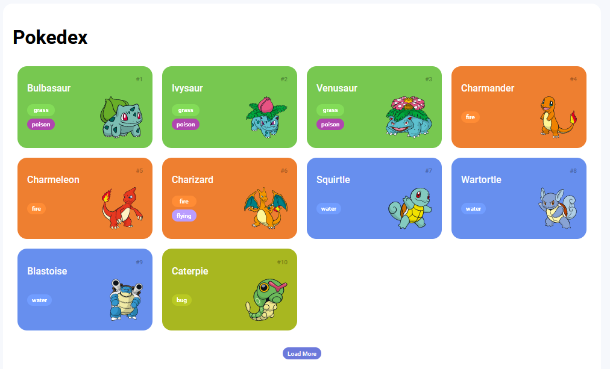

# Trilha JS Developer - Pokedex

Este é um projeto de uma Pokédex desenvolvido durante o Bootcamp Java + Angular Fullstack da empresa DIO (Digital Innovation One). O projeto consiste em uma aplicação web que exibe informações sobre diferentes pokémons, permitindo aos usuários explorar suas características, tipos, habilidades e mais. Para executar o projeto, será necessário configurar um servidor HTTP local.



## Funcionalidades

- **Lista de Pokémons:** A aplicação exibe uma lista de pokémons com suas imagens e nomes. Os pokémons são carregados a partir de uma fonte de dados externa.

- **Load More - Carregar Mais Tipos:** Ao clicar no botão "Load More", mais tipos de pokémons serão carregados e exibidos na lista. Esta funcionalidade permite aos usuários explorar diferentes tipos de pokémons.

## Tecnologias Utilizadas

- **HTML:** A estrutura básica da aplicação foi desenvolvida utilizando HTML.

- **CSS:** O estilo visual da aplicação foi implementado com CSS, garantindo um layout agradável e responsivo.

- **JavaScript:** A interatividade da aplicação foi construída com JavaScript. A manipulação do DOM permite atualizar as informações exibidas e melhorar a experiência do usuário.

- **Fonte de Dados:** As informações dos pokémons foram obtidas de uma API pública, que fornece detalhes como nome, número da pokédex, tipos, habilidades e imagens.

- **HTTP-Server:** Para executar o projeto, será necessário um servidor HTTP local. Utilize o http-server para isso.

## Instruções de Uso

1. Clone ou baixe este repositório para a sua máquina local.

2. Certifique-se de ter o [Node.js](https://nodejs.org/) instalado em sua máquina.

3. Abra o terminal e navegue até o diretório raiz do projeto.

4. Instale o `http-server` globalmente, se ainda não estiver instalado, usando o seguinte comando:

   ```bash
   npm install -g http-server
   ```

5. Inicie o servidor HTTP local utilizando o comando:

   ```bash
   http-server
   ```

6. Após iniciar o servidor, você receberá uma mensagem informando o endereço local onde a aplicação está sendo executada (geralmente http://localhost:8080). Abra este URL em seu navegador.

7. Explore a lista de pokémons e clique no botão "Load More" para carregar mais tipos de pokémons na lista.

## Créditos

Este projeto foi desenvolvido como parte do Bootcamp Java + Angular Fullstack da DIO. Agradecemos à DIO por fornecer a oportunidade de aprender e aplicar novas habilidades de desenvolvimento web.

**Nota:** Este projeto é apenas para fins educacionais e não possui nenhuma afiliação oficial com a franquia Pokémon ou suas empresas associadas.