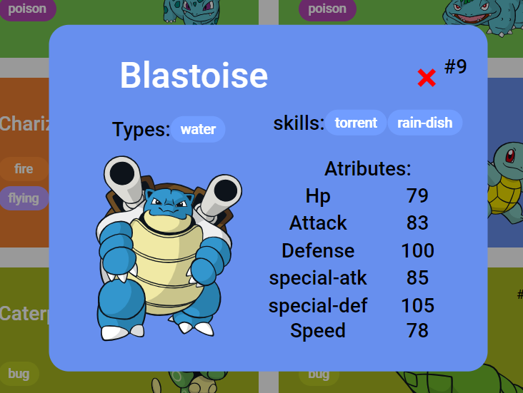

# Trilha JS Developer - Pokédex
#### **Uma Pokédex construída dinamicamente com JS**

Este projeto foi solicitado como um desafio da [**Formação JavaScript Developer**](https://www.dio.me/curso-javascript) da [DIO - Digital Innovation One](https://www.dio.me). O objetivo do projeto era adquirir conhecimento e praticar o consumo de uma API REST, usando a [PokeAPI](https://pokeapi.co/), a API RESTful dos Pokémon.

#### As informações do pokémon são exibidas em forma de modal que é aberto ao clicar em cima do card do pokemon desejado, serão exibidas as informações dos atributos do Pokémon: Hp, Attack, Defense, Special-Attack, Special-Defense and Speed. Alem das skills do pokémon, ambas vem dinamicamente da API com JS.

  

#### Forked from [js-developer-pokedex](https://github.com/digitalinnovationone/js-developer-pokedex)

---

#### Description in english

# JS Developer Trail - Pokédex
#### **A Pokédex built dynamically with JS**

This project was requested as a challenge for the [**JavaScript Developer Training**](https://www.dio.me/curso-javascript) of [DIO - Digital Innovation One](https:// www.dio.me/curso-javascript). dio.me). The objective of the project was to acquire knowledge and practice consuming a REST API, using [PokeAPI](https://pokeapi.co/), the Pokémon RESTful API.

#### The pokémon's information is displayed in the form of a modal that opens when clicking on the desired pokemon's card. In addition to pokémon skills, both come dynamically from the API with JS.

#### Forked from [js-developer-pokedex](https://github.com/digitalinnovationone/js-developer-pokedex)
