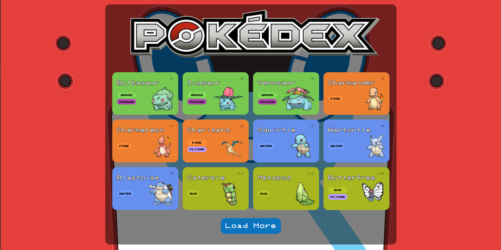
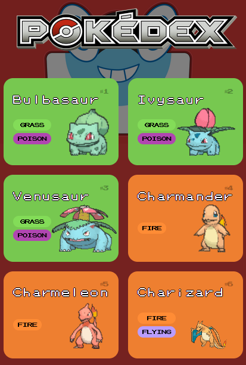
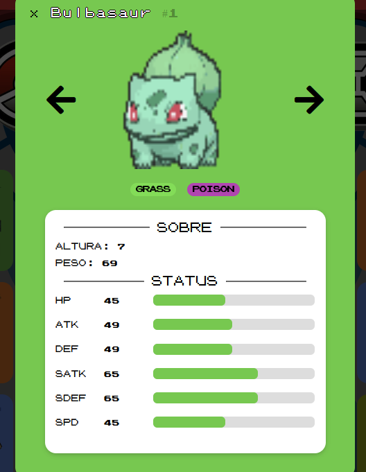

# Pokédex 🕹️

Projeto de desenvolvimento de uma Pokédex proposto pelo Bootcamp da [Digital Innovation One - DIO](https://web.dio.me/home) sobre Desenvolvimento Frontend com Angular.  

Trata-se de uma aplicação que utiliza a [PokeApi](https://pokeapi.co/) para apresentar detalhes de Pokémons da <strong>Primeira Geração</strong>.

## Tecnologias Utilizadas 🚀

## Prints to Website 🖥️

### Página Inicial (Tela com Zoom-out de 70%) 🌐

### Tela Mobile 📱

### Detalhes do Pokémon 🔎

## Conclusão 📝

<h4>O projeto Pokédex foi um excelente desafio que eu me diverti bastante fazendo! Além disso, dei o meu melhor para incluir todas as ideias que vinham na minha cabeça durante a produção e tenho certeza que aprendi bastante desenvolvendo.</h4>
